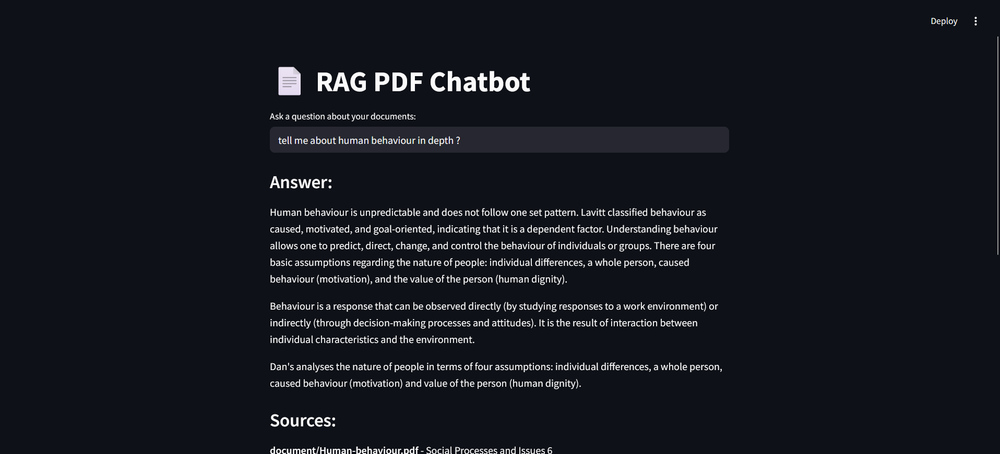
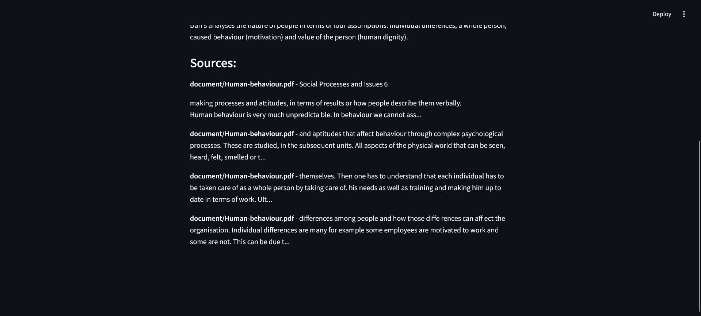

# 📄 RAG PDF Chatbot

A Retrieval-Augmented Generation (RAG) based chatbot that can answer questions about PDF documents using advanced language models and vector similarity search.



<!-- Add your image from the public folder here -->

## 🚀 Features

- PDF document processing and chunking
- Vector embeddings using HuggingFace's all-MiniLM-L6-v2
- Persistent vector storage with ChromaDB
- Question-answering using Google's Gemini 2.0 Flash model
- Interactive Streamlit web interface
- Source attribution for answers

## 🛠️ Technologies Used

- LangChain
- ChromaDB
- Sentence Transformers
- PyPDF
- Streamlit
- Google Gemini API
- HuggingFace Embeddings

## ⚙️ Setup and Installation

1. Clone the repository:
```bash
git clone <repository-url>
cd rag-chatbot
```

2. Create and activate a virtual environment:
```bash
python -m venv venv
source venv/bin/activate  # On Windows: venv\Scripts\activate
```

3. Install required packages:
```bash
pip install -r requirements.txt
```

4. Set up environment variables:
   - Create a `.env` file
   - Add your Google API key:
```
GOOGLE_API_KEY=your_api_key_here
```

## 💻 Usage

1. Store your PDF documents in the `document` folder

2. Index your documents:
```bash
python store_index.py
```

3. Run the Streamlit app:
```bash
streamlit run app.py
```

4. Open your browser and navigate to the provided local URL

## 🏗️ Project Structure

- `app.py`: Main Streamlit application
- `store_index.py`: Document processing and indexing script
- `requirements.txt`: Project dependencies
- `document/`: Directory for PDF files
- `chroma_db/`: Vector store directory (auto-generated)

## 🔒 Environment Variables

- `GOOGLE_API_KEY`: Your Google API key for accessing the Gemini model

